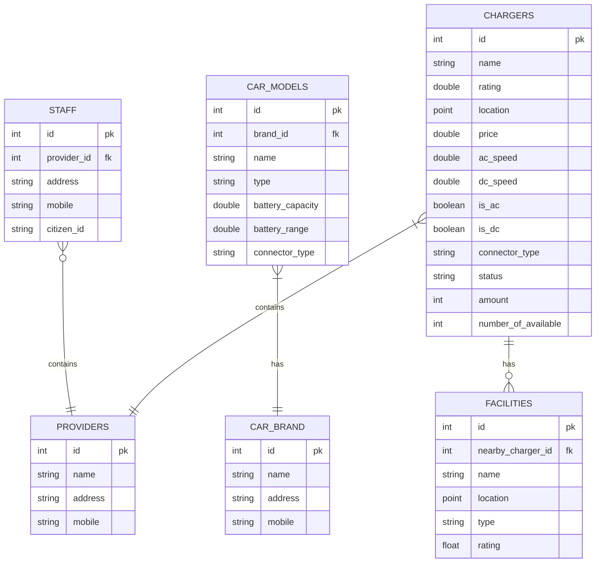

```mermaid
    erDiagram
        STAFF {
            int id pk
            int provider_id fk
            string address
            string mobile
            string citizen_id
        }
        PROVIDERS {
            int id pk
            string name
            string address
            string mobile
        }
        CAR_MODELS {
            int id pk
            int brand_id fk
            string name
            string type
            double battery_capacity
            double battery_range
            string connector_type
        }
        CAR_BRAND {
            int id pk
            string name
            string address
            string mobile
        }
        FACILITIES {
            int id pk
            int nearby_charger_id fk
            string name
            point location
            string type
            float rating
        }
        CHARGERS {
            int id pk
            string name
            double rating
            point location
            double price
            double ac_speed
            double dc_speed
            boolean is_ac
            boolean is_dc
            string connector_type
            string status
            int amount
            int number_of_available
        }

        STAFF o{--|| PROVIDERS : contains
        CHARGERS |{--|| PROVIDERS : contains
        CAR_MODELS |{--|| CAR_BRAND : has
        CHARGERS ||--o{ FACILITIES : has
```     
