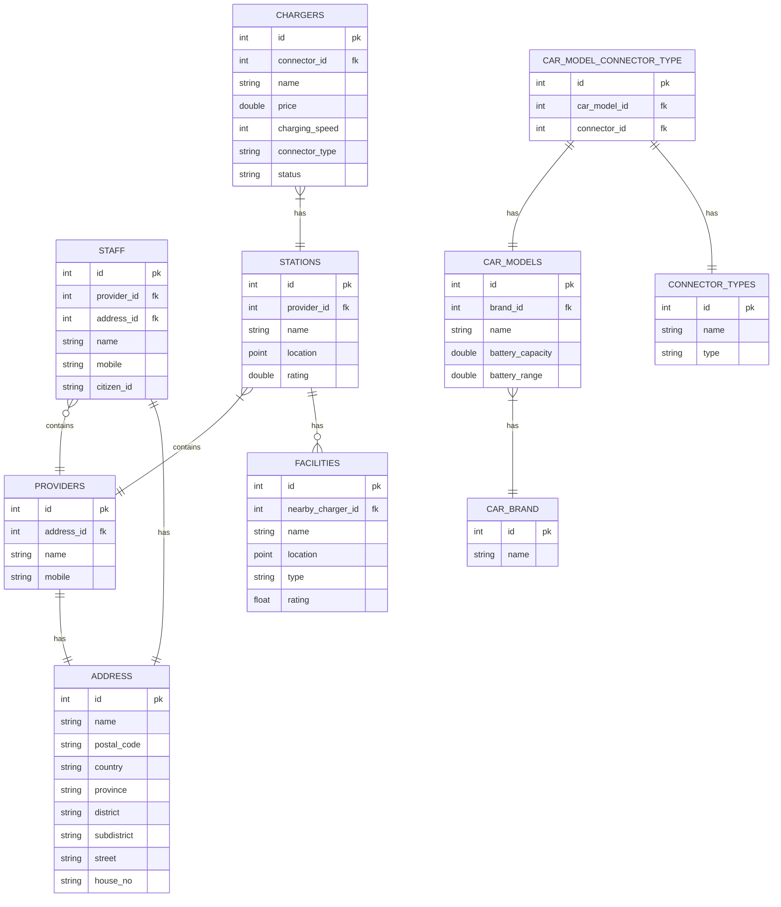

```mermaid
    erDiagram
        STAFF {
            int id pk
            int provider_id fk
            int address_id fk
            string name
            string mobile
            string citizen_id
        }
        PROVIDERS {
            int id pk
            int address_id fk
            string name
            string mobile
        }
        CAR_MODELS {
            int id pk
            int brand_id fk
            string name
            double battery_capacity
            double battery_range
        }
        CAR_BRAND {
            int id pk
            string name
        }
        FACILITIES {
            int id pk
            int nearby_charger_id fk
            string name
            point location
            string type
            float rating
        }
        CHARGERS {
            int id pk
            int connector_id fk
            string name
            double price
            int charging_speed
            string connector_type
            string status
        }
        STATIONS {
            int id pk
            int provider_id fk
            string name
            point location
            double rating
        }
        ADDRESS {
            int id pk
            string name
            string postal_code
            string country
            string province
            string district
            string subdistrict
            string street
            string house_no
        }
        CONNECTOR_TYPES {
            int id pk
            string name
            string type
        }
        CAR_MODEL_CONNECTOR_TYPE {
            int id pk
            int car_model_id fk
            int connector_id fk
        }
        STAFF o{--|| PROVIDERS : contains
        STATIONS |{--|| PROVIDERS : contains
        CAR_MODELS |{--|| CAR_BRAND : has
        STATIONS ||--o{ FACILITIES : has
        CHARGERS |{--|| STATIONS : has
        STAFF ||--|| ADDRESS : has
        PROVIDERS ||--|| ADDRESS : has
        CAR_MODEL_CONNECTOR_TYPE ||--|| CAR_MODELS : has
        CAR_MODEL_CONNECTOR_TYPE ||--|| CONNECTOR_TYPES : has
```     
