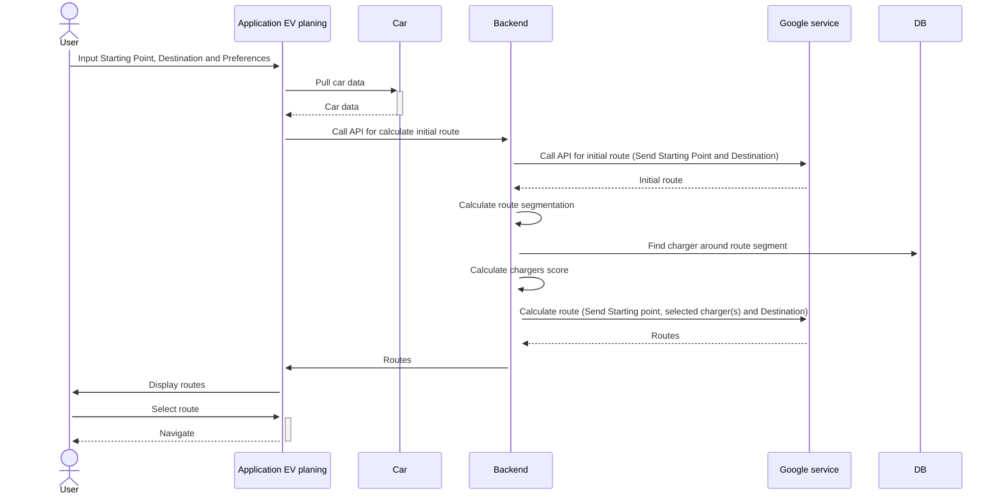

```mermaid
  sequenceDiagram
      actor User
      User->>+Application EV planing: Input Starting Point, Destination and Preferences
      Application EV planing->>+Car: Pull car data
      Car-->>-Application EV planing: Car data
      Application EV planing->>+Backend: Call API for calculate initial route
      Backend->>+Google service: Call API for initial route (Send Starting Point and Destination)
      Google service-->>+Backend: Initial route
      Backend->>+Backend: Calculate route segmentation
      Backend->>+DB: Find charger around route segment
      Backend->>+Backend: Calculate chargers score
      Backend->>+Google service: Calculate route (Send Starting point, selected charger(s) and Destination)
      Google service-->>+Backend: Routes
      Backend->>+Application EV planing: Routes
      Application EV planing->>+User: Display routes
      User->>+Application EV planing: Select route
      Application EV planing-->>-User: Navigate
```
