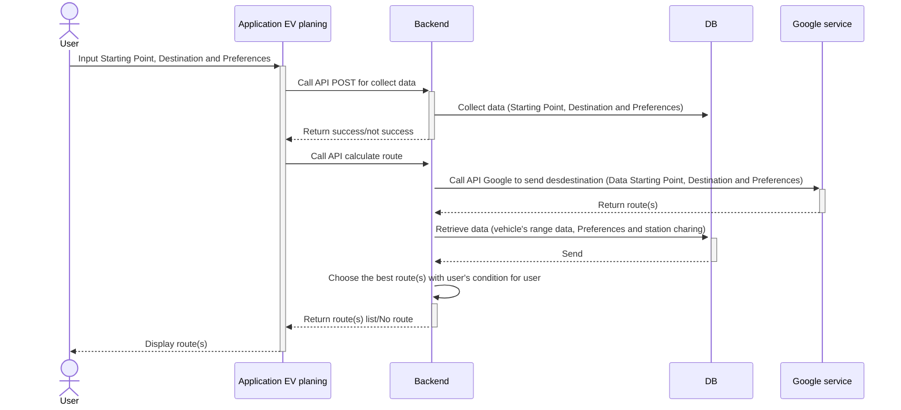

```mermaid
  sequenceDiagram
      actor User
      User->>+Application EV planing: Input Starting Point, Destination and Preferences
      Application EV planing->>+Backend: Call API POST for collect data
      Backend->>+DB: Collect data (Starting Point, Destination and Preferences)
      Backend-->>-Application EV planing: Return success/not success
      Application EV planing->>+Backend: Call API calculate route
      Backend->>+Google service: Call API Google to send desdestination (Data Starting Point, Destination and Preferences)
      Google service-->>-Backend: Return route(s)
      Backend->>+DB: Retrieve data (vehicle's range data, Preferences and station charing)
      DB-->>-Backend: Send 
      Backend->>+Backend: Choose the best route(s) with user's condition for user
      Backend-->>-Application EV planing: Return route(s) list/No route
      Application EV planing-->>-User: Display route(s)
```
